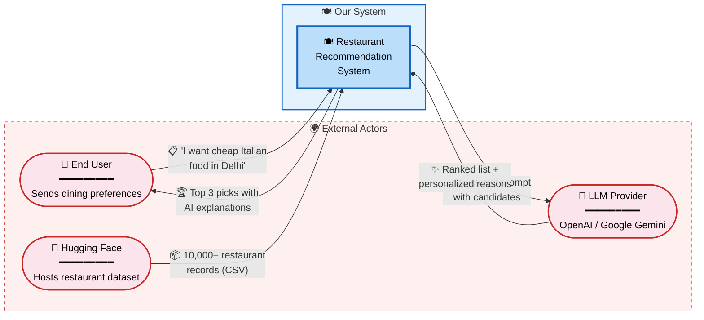
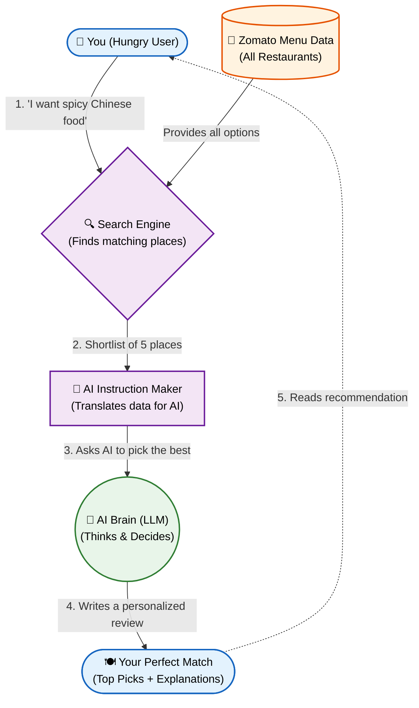
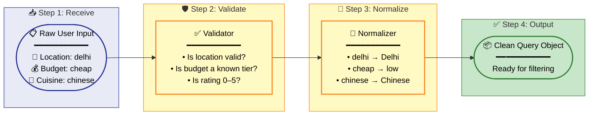
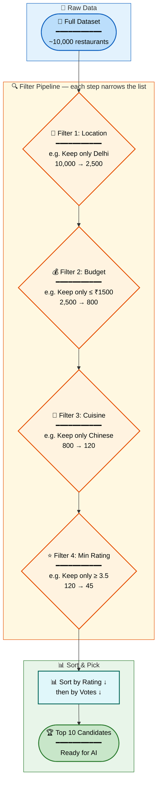
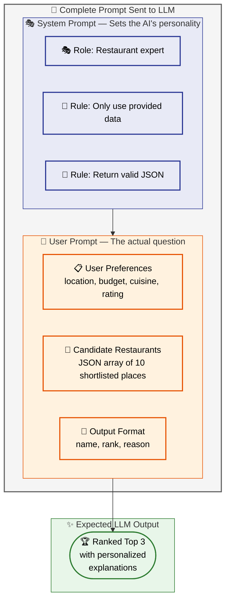
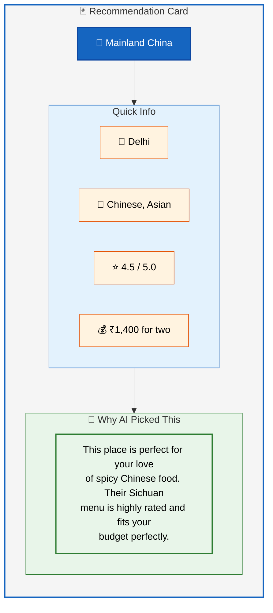
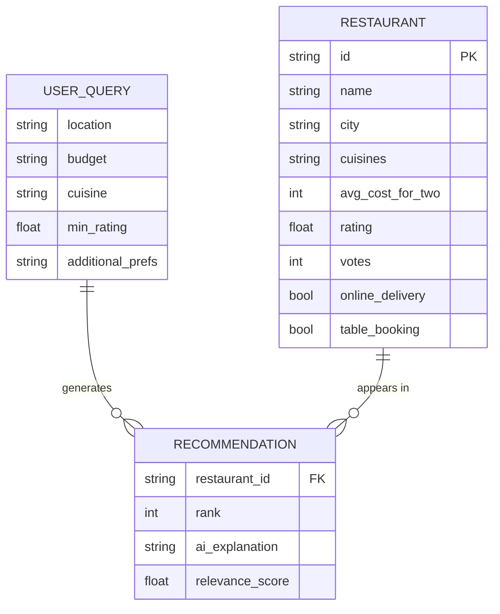
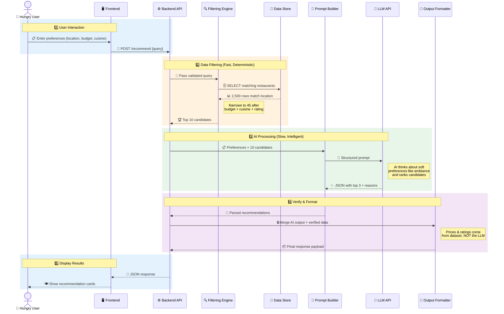
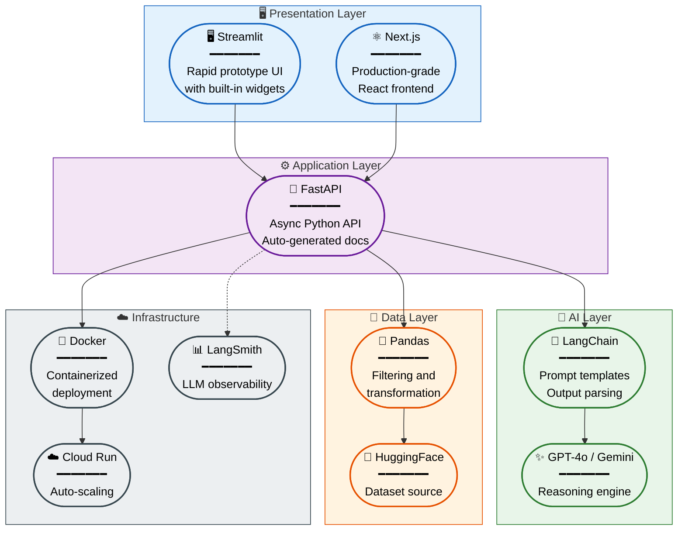
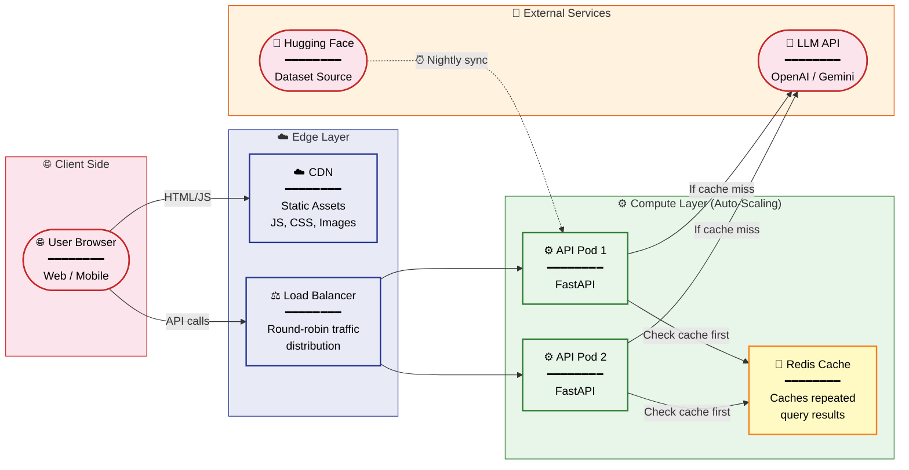

# Architecture Document

## AI-Powered Restaurant Recommendation System (Zomato Use Case)

> **Version:** 1.0  
> **Last Updated:** August 2026  
> **Source:** [problemStatement.md](./problemStatement.md)

---

## Table of Contents

1. [Overview](#1-overview)
2. [High-Level Architecture](#2-high-level-architecture)
3. [Component Deep Dive](#3-component-deep-dive)
4. [Data Model](#4-data-model)
5. [API Contract](#5-api-contract)
6. [Prompt Engineering Strategy](#6-prompt-engineering-strategy)
7. [Request Lifecycle (End-to-End)](#7-request-lifecycle-end-to-end)
8. [Error Handling & Edge Cases](#8-error-handling--edge-cases)
9. [Non-Functional Requirements](#9-non-functional-requirements)
10. [Recommended Tech Stack](#10-recommended-tech-stack)
11. [Deployment Architecture](#11-deployment-architecture)
12. [Future Enhancements](#12-future-enhancements)

---

## 1. Overview

The system is an AI-powered restaurant recommendation service that combines **structured data filtering** with **LLM-based reasoning** to produce personalized, human-readable restaurant suggestions.

**Core Idea:** Rather than showing raw search results, we use an LLM to *think* about the filtered restaurants and explain *why* each one is a good match — turning a database query into a concierge-like experience.

---

## 2. High-Level Architecture

### 2.1 System Context Diagram

Shows how external actors interact with the system boundary.



### 2.2 Internal Component Diagram

Shows the modules *inside* the system and how data flows between them.



---

## 3. Component Deep Dive

### 3.1 Data Ingestion Layer

| Aspect | Detail |
|---|---|
| **Source** | [Hugging Face – zomato-restaurant-recommendation](https://huggingface.co/datasets/ManikaSaini/zomato-restaurant-recommendation) |
| **Format** | CSV / Parquet via `datasets` library |
| **Trigger** | On application startup (or scheduled refresh) |
| **Processing** | Clean nulls, normalize text (lowercase city/cuisine names), map cost to budget tiers, parse ratings to float |

**Key fields extracted:**

| Field | Type | Example |
|---|---|---|
| `restaurant_name` | string | `"Barbeque Nation"` |
| `location` / `city` | string | `"Delhi"` |
| `cuisines` | list[string] | `["North Indian", "Chinese"]` |
| `average_cost_for_two` | int | `1200` |
| `aggregate_rating` | float | `4.3` |
| `votes` | int | `1542` |
| `has_online_delivery` | bool | `true` |
| `has_table_booking` | bool | `true` |

### 3.2 User Input Handler

Responsible for collecting, validating, and normalizing user preferences before they reach the filtering engine.



**Input Fields & Validation Rules:**

| Field | Required | Validation | Default |
|---|---|---|---|
| `location` | Yes | Must match a known city in dataset | — |
| `budget` | No | One of `low`, `medium`, `high` | `medium` |
| `cuisine` | No | Fuzzy-matched against known cuisines | Any |
| `min_rating` | No | Float between 0.0 and 5.0 | `3.0` |
| `additional_prefs` | No | Free text (max 200 chars) | Empty |

**Budget Tier Mapping:**

| Tier | Cost for Two (₹) |
|---|---|
| Low | ≤ 500 |
| Medium | 501 – 1500 |
| High | > 1500 |

### 3.3 Filtering Engine (Integration Layer)

This is the deterministic core that narrows thousands of restaurants to a manageable shortlist before passing them to the LLM.

**Why filter first?**
- LLMs have token limits — we can't send 10,000 restaurants.
- Deterministic filtering is faster and cheaper than LLM inference.
- Ensures factual accuracy (the LLM can't hallucinate a restaurant that doesn't exist in the data).

**Filtering Pipeline:**



**Filter Order Rationale:** Location is the most restrictive filter (eliminates the most rows), so it runs first for performance. Rating is last because it's a soft preference.

### 3.4 LLM Prompt Builder

Transforms the shortlisted restaurant data + user preferences into a well-structured prompt for the LLM.

**Prompt Template Structure:**



### 3.5 Recommendation Engine (LLM)

| Aspect | Detail |
|---|---|
| **Provider** | OpenAI (GPT-4o) / Google (Gemini 1.5 Pro) |
| **Task** | Rank candidates, generate explanations |
| **Input** | Structured prompt from Prompt Builder |
| **Output** | JSON array of ranked restaurants with `reason` field |
| **Temperature** | 0.3 – 0.5 (creative enough to write varied explanations, but grounded) |
| **Max Tokens** | ~1000 (enough for top 3–5 recommendations with explanations) |

### 3.6 Output Formatter & Display

Parses the LLM response, merges it back with verified structured data (to prevent any hallucinated numbers), and renders it to the user.

**Output Card Structure (per restaurant):**



---

## 4. Data Model

### 4.1 Entity Relationship



### 4.2 Data Dictionary

| Entity | Field | Type | Description |
|---|---|---|---|
| `USER_QUERY` | `location` | string | Target city for dining |
| `USER_QUERY` | `budget` | enum | `low` / `medium` / `high` |
| `USER_QUERY` | `cuisine` | string | Preferred cuisine type |
| `USER_QUERY` | `min_rating` | float | Minimum acceptable rating (0–5) |
| `USER_QUERY` | `additional_prefs` | string | Free-text preferences |
| `RESTAURANT` | `id` | string | Unique identifier |
| `RESTAURANT` | `name` | string | Restaurant name |
| `RESTAURANT` | `city` | string | City/location |
| `RESTAURANT` | `cuisines` | string | Comma-separated cuisine list |
| `RESTAURANT` | `avg_cost_for_two` | int | Average cost in ₹ |
| `RESTAURANT` | `rating` | float | Aggregate rating |
| `RESTAURANT` | `votes` | int | Number of user votes |
| `RECOMMENDATION` | `rank` | int | LLM-assigned rank (1 = best) |
| `RECOMMENDATION` | `ai_explanation` | string | LLM-generated justification |

---

## 5. API Contract

### 5.1 `POST /recommend`

**Request Body:**

```json
{
  "location": "Delhi",
  "budget": "medium",
  "cuisine": "Chinese",
  "min_rating": 3.5,
  "additional_prefs": "family-friendly, quick service"
}
```

**Success Response (200):**

```json
{
  "query": { ... },
  "recommendations": [
    {
      "rank": 1,
      "restaurant": {
        "name": "Mainland China",
        "city": "Delhi",
        "cuisines": ["Chinese", "Asian"],
        "avg_cost_for_two": 1400,
        "rating": 4.5,
        "votes": 2031,
        "online_delivery": true,
        "table_booking": true
      },
      "ai_explanation": "Mainland China is an excellent match for your request. Their authentic Sichuan and Cantonese menu is highly rated (4.5★), fits comfortably within your medium budget at ₹1,400 for two, and they're known for being family-friendly with spacious seating."
    }
  ],
  "meta": {
    "total_filtered": 42,
    "model_used": "gpt-4o",
    "latency_ms": 1830
  }
}
```

**Error Response (422) — No Matches:**

```json
{
  "error": "no_matches",
  "message": "No restaurants found matching all your criteria. Try broadening your location or budget.",
  "suggestions": ["Try 'any' cuisine", "Lower minimum rating to 3.0"]
}
```

---

## 6. Prompt Engineering Strategy

### 6.1 System Prompt

```text
You are a friendly restaurant recommendation expert. You will receive:
1. A user's dining preferences
2. A list of candidate restaurants with their details

Your job:
- Rank the top 3 restaurants that best match the user's preferences.
- For each, write a 2-3 sentence explanation in a warm, conversational tone.
- ONLY use information from the provided restaurant data. Do NOT invent details.
- Return your response as a valid JSON array.
```

### 6.2 User Prompt Template

```text
## User Preferences
- Location: {location}
- Budget: {budget} (₹{budget_range})
- Cuisine: {cuisine}
- Minimum Rating: {min_rating}
- Other: {additional_prefs}

## Candidate Restaurants
{candidates_json}

## Instructions
Return a JSON array of the top 3 recommendations. Each item should have:
- "name": restaurant name (must match exactly from the data)
- "rank": 1, 2, or 3
- "reason": your explanation for why this restaurant is a great fit
```

### 6.3 Anti-Hallucination Guardrails

| Guardrail | Implementation |
|---|---|
| Grounded data only | System prompt explicitly says "ONLY use provided data" |
| Name verification | Output parser checks that returned names exist in the candidate list |
| Number verification | Cost and rating in the display are pulled from the dataset, NOT the LLM output |
| Structured output | JSON mode enforced to prevent free-form deviation |

---

## 7. Request Lifecycle (End-to-End)



---

## 8. Error Handling & Edge Cases

| Scenario | Behavior |
|---|---|
| **No restaurants match filters** | Return friendly message with suggestions to broaden criteria. Skip LLM call entirely. |
| **Very few matches (< 3)** | Proceed with available candidates. LLM explains it found limited options. |
| **LLM timeout / failure** | Return filtered results without AI explanations. Show fallback message: "AI insights temporarily unavailable." |
| **LLM returns invalid JSON** | Retry once with stricter prompt. If still invalid, fall back to raw filtered results. |
| **LLM hallucinates a restaurant name** | Output parser drops any recommendation whose name doesn't match the candidate list. |
| **Unknown location entered** | Return 422 error with list of supported cities from the dataset. |
| **Rate limit exceeded (LLM API)** | Queue the request and retry with exponential backoff. Show loading indicator to user. |

---

## 9. Non-Functional Requirements

| Requirement | Target | Strategy |
|---|---|---|
| **Latency** | < 3 seconds end-to-end | Pre-filter aggressively, use streaming LLM responses, cache dataset in memory |
| **Accuracy** | 100% for structured data (cost, rating) | Always display data from the dataset, never from LLM output |
| **Availability** | 99.5% uptime | Graceful degradation — if LLM is down, serve filtered results without explanations |
| **Scalability** | Support 100 concurrent users | Stateless API, horizontal scaling, async LLM calls |
| **Security** | No data leakage | LLM API key stored in env vars, user input sanitized before prompt injection |
| **Cost** | Minimize LLM API spend | Cache repeated identical queries, limit candidates to top 10, cap output tokens |

---

## 10. Recommended Tech Stack



| Layer | Technology | Why |
|---|---|---|
| **Frontend** | Streamlit (prototype) or Next.js (production) | Streamlit enables rapid prototyping with built-in widgets; Next.js for a polished UI |
| **Backend API** | Python + FastAPI | Async support, auto-generated docs, great for ML/AI workflows |
| **Data Processing** | Pandas + HuggingFace `datasets` | Native Hugging Face integration, powerful filtering & transformation |
| **LLM Integration** | LangChain or direct OpenAI/Gemini SDK | LangChain for prompt templating, chaining, and output parsing |
| **LLM Provider** | OpenAI GPT-4o or Google Gemini 1.5 Pro | High quality reasoning and instruction following |
| **Deployment** | Docker → Cloud Run / Railway / Render | Containerized, auto-scaling, cost-effective for prototypes |
| **Observability** | LangSmith or structured logging | Trace prompts, latency, and LLM responses for debugging |

---

## 11. Deployment Architecture



---

## 12. Future Enhancements

| Enhancement | Description | Impact |
|---|---|---|
| **Conversational mode** | Multi-turn chat for refining preferences ("Show me cheaper options") | Better UX |
| **Vector search (RAG)** | Embed restaurant descriptions and use semantic similarity search before LLM | Better matching for vague queries |
| **User history** | Remember past preferences and orders for personalized future recommendations | Higher relevance |
| **Review summarization** | Feed user reviews into the LLM for richer explanations | Deeper insights |
| **Multi-language support** | Serve recommendations in Hindi, Tamil, etc. | Wider reach |
| **A/B testing** | Compare different prompt strategies and LLM models for quality | Continuous improvement |
