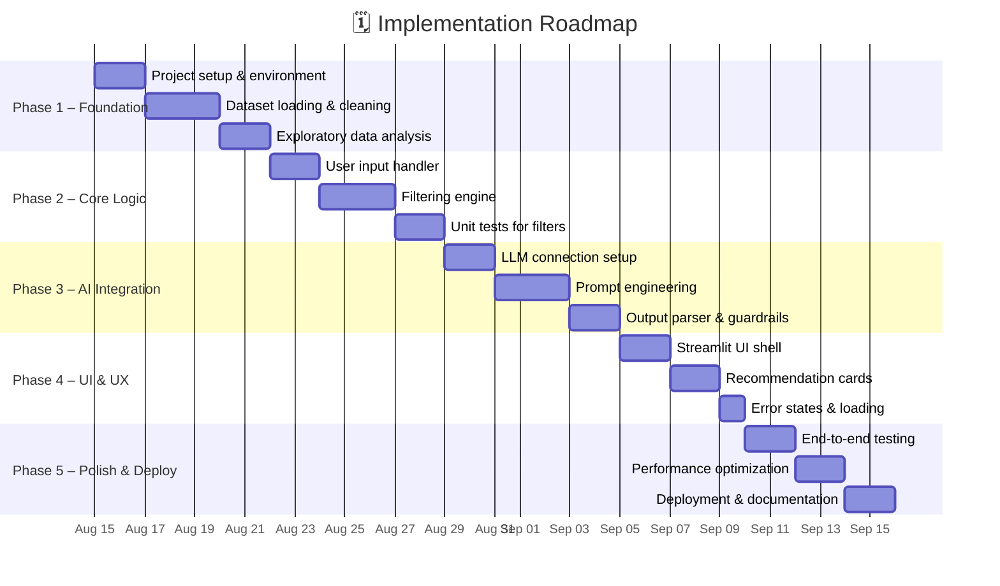
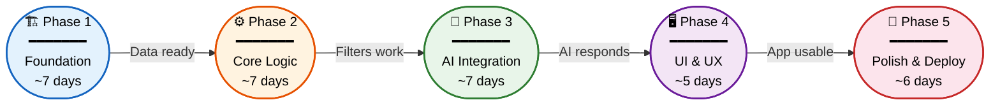
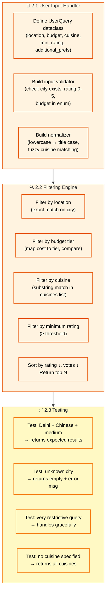
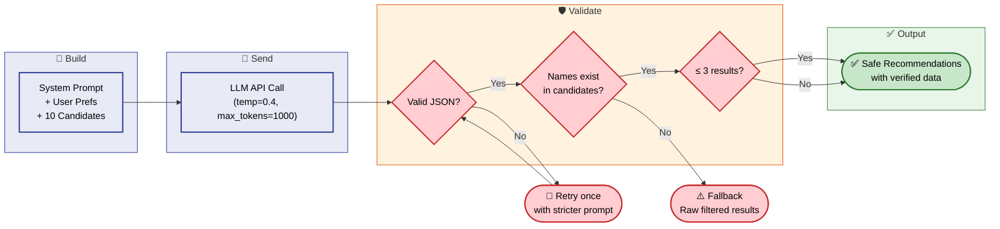
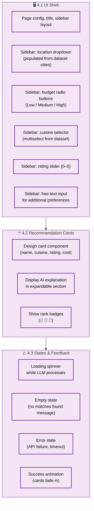
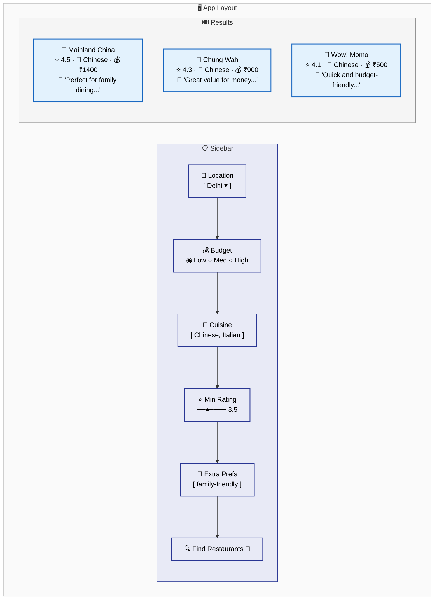
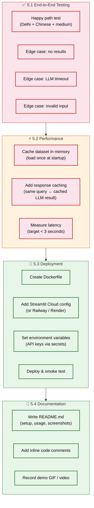
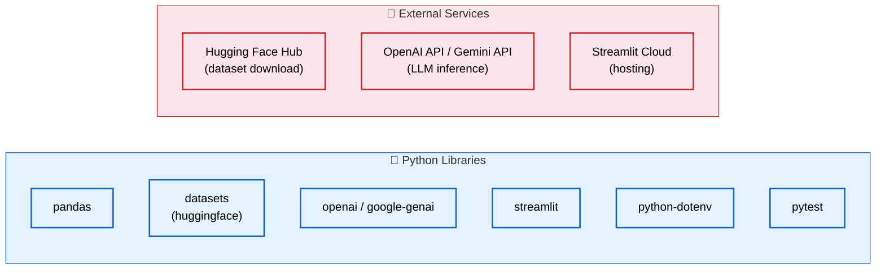

# Implementation Plan

## AI-Powered Restaurant Recommendation System

> **Based on:** [problemStatement.md](./problemStatement.md) · [architecture.md](./architecture.md)  
> **Last Updated:** August 2026

---

## Roadmap Overview



---

## Phase Summary



---

## Phase 1: Foundation & Data Ingestion

> **Goal:** Set up the project, load the dataset, and understand the data.  
> **Duration:** ~7 days  
> **Deliverable:** Clean, indexed DataFrame ready for querying

### Tasks



```mermaid
flowchart TD
    classDef todo fill:#e3f2fd,stroke:#1565c0,stroke-width:2px,color:#000
    classDef done fill:#c8e6c9,stroke:#2e7d32,stroke-width:2px,color:#000

    subgraph S1 [" 📦 1.1 Project Setup "]
        A1["Initialize Python project<br/>(pyproject.toml / requirements.txt)"]:::todo
        A2["Create folder structure<br/>src/ tests/ data/ notebooks/"]:::todo
        A3["Set up virtual environment<br/>(.venv + pip install)"]:::todo
        A4["Initialize Git repo<br/>+ .gitignore"]:::todo
    end

    subgraph S2 [" 📂 1.2 Data Loading "]
        B1["Install huggingface datasets<br/>pip install datasets"]:::todo
        B2["Download Zomato dataset<br/>ManikaSaini/zomato-restaurant-recommendation"]:::todo
        B3["Convert to Pandas DataFrame"]:::todo
        B4["Save local cache<br/>(CSV / Parquet)"]:::todo
    end

    subgraph S3 [" 🧹 1.3 Data Cleaning "]
        C1["Handle missing values<br/>(drop or fill defaults)"]:::todo
        C2["Normalize text fields<br/>(lowercase city, cuisine names)"]:::todo
        C3["Parse ratings to float<br/>(handle 'NEW', '-' values)"]:::todo
        C4["Map cost → budget tiers<br/>(low ≤500, med 501-1500, high >1500)"]:::todo
    end

    subgraph S4 [" 📊 1.4 EDA (Exploratory Analysis) "]
        D1["Distribution of restaurants<br/>per city"]:::todo
        D2["Rating distribution<br/>& outliers"]:::todo
        D3["Most common cuisines<br/>& cost ranges"]:::todo
        D4["Create summary notebook<br/>with visualizations"]:::todo
    end

    S1 --> S2 --> S3 --> S4

    style S1 fill:#e3f2fd,stroke:#1565c0,stroke-width:1px
    style S2 fill:#e3f2fd,stroke:#1565c0,stroke-width:1px
    style S3 fill:#e3f2fd,stroke:#1565c0,stroke-width:1px
    style S4 fill:#e3f2fd,stroke:#1565c0,stroke-width:1px
```

### Folder Structure

```
zomato-recommender/
├── src/
│   ├── __init__.py
│   ├── data_loader.py        # Dataset loading & caching
│   ├── data_cleaner.py       # Preprocessing & normalization
│   ├── filter_engine.py      # Phase 2
│   ├── prompt_builder.py     # Phase 3
│   ├── llm_client.py         # Phase 3
│   ├── output_formatter.py   # Phase 3
│   └── app.py                # Phase 4 (Streamlit entry)
├── tests/
│   ├── test_data_loader.py
│   ├── test_filter_engine.py
│   └── test_prompt_builder.py
├── notebooks/
│   └── eda.ipynb              # Exploratory analysis
├── data/
│   └── .gitkeep               # Local cache (gitignored)
├── .env                       # API keys (gitignored)
├── .gitignore
├── requirements.txt
└── README.md
```

### Key Decisions

| Decision | Choice | Rationale |
|---|---|---|
| Dataset format | Parquet (local cache) | Faster reads than CSV, smaller file size |
| Data framework | Pandas | Simple, well-documented, sufficient for ~10K rows |
| Budget tiers | Low ≤ ₹500, Medium ₹501–1500, High > ₹1500 | Based on Zomato's typical price distribution |

### Exit Criteria

- [ ] Dataset loads successfully from Hugging Face
- [ ] DataFrame has no null values in critical columns (name, city, rating, cost)
- [ ] All text fields are normalized (consistent casing)
- [ ] Budget tier column is added
- [ ] EDA notebook shows data distribution insights

---

## Phase 2: Core Filtering Logic

> **Goal:** Build the deterministic filtering engine that narrows restaurants before AI.  
> **Duration:** ~7 days  
> **Deliverable:** A function that takes user preferences → returns top 10 candidates

### Tasks



### API Design

```python
# src/filter_engine.py

@dataclass
class UserQuery:
    location: str                    # Required
    budget: str = "medium"           # low | medium | high
    cuisine: str = ""                # Optional, fuzzy matched
    min_rating: float = 3.0          # 0.0 – 5.0
    additional_prefs: str = ""       # Free text for LLM

def filter_restaurants(df: pd.DataFrame, query: UserQuery) -> pd.DataFrame:
    """Returns top 10 candidates sorted by rating, votes."""
    ...
```

### Exit Criteria

- [ ] `UserQuery` dataclass validates and normalizes all inputs
- [ ] `filter_restaurants()` correctly chains location → budget → cuisine → rating filters
- [ ] Returns top 10 candidates sorted by (rating desc, votes desc)
- [ ] Handles edge cases: no matches, partial matches, unknown city
- [ ] All unit tests pass

---

## Phase 3: AI / LLM Integration

> **Goal:** Connect to an LLM, build prompts, parse responses, and add safety guardrails.  
> **Duration:** ~7 days  
> **Deliverable:** Function that takes candidates + preferences → returns ranked recommendations with explanations

### Tasks



```mermaid
flowchart TD
    classDef task fill:#e8f5e9,stroke:#2e7d32,stroke-width:2px,color:#000
    classDef critical fill:#ffcdd2,stroke:#c62828,stroke-width:2px,color:#000

    subgraph S1 [" 🔌 3.1 LLM Connection "]
        A1["Install openai / google-genai SDK"]:::task
        A2["Create .env with API key<br/>(OPENAI_API_KEY or GEMINI_KEY)"]:::task
        A3["Build LLMClient wrapper class<br/>(send_prompt, handle errors)"]:::task
        A4["Test basic prompt-response<br/>roundtrip"]:::task
    end

    subgraph S2 [" 📝 3.2 Prompt Engineering "]
        B1["Write system prompt<br/>(role, rules, anti-hallucination)"]:::task
        B2["Write user prompt template<br/>(preferences + candidates JSON)"]:::task
        B3["Define output JSON schema<br/>(name, rank, reason)"]:::task
        B4["Iterate on prompt quality<br/>(test with 5+ different queries)"]:::task
    end

    subgraph S3 [" 🛡️ 3.3 Safety Guardrails "]
        C1["Validate restaurant names<br/>exist in candidate list"]:::critical
        C2["Pull cost/rating from dataset<br/>NOT from LLM output"]:::critical
        C3["Handle malformed JSON<br/>(retry once, then fallback)"]:::critical
        C4["Set temperature 0.3-0.5<br/>for grounded responses"]:::task
    end

    subgraph S4 [" 🎨 3.4 Output Formatting "]
        D1["Parse LLM JSON response"]:::task
        D2["Merge with verified dataset fields"]:::task
        D3["Build Recommendation dataclass<br/>(rank, restaurant, ai_explanation)"]:::task
    end

    S1 --> S2 --> S3 --> S4

    style S1 fill:#e8f5e9,stroke:#2e7d32,stroke-width:1px
    style S2 fill:#e8f5e9,stroke:#2e7d32,stroke-width:1px
    style S3 fill:#ffebee,stroke:#c62828,stroke-width:1px
    style S4 fill:#e8f5e9,stroke:#2e7d32,stroke-width:1px
```

### Prompt Strategy



### Exit Criteria

- [ ] LLM client connects and returns valid responses
- [ ] System prompt + user prompt template produce high-quality recommendations
- [ ] Output parser validates JSON, restaurant names, and field accuracy
- [ ] Fallback mechanism works when LLM returns invalid data
- [ ] 5+ diverse test queries produce relevant, well-explained results

---

## Phase 4: User Interface

> **Goal:** Build a clean, interactive Streamlit UI.  
> **Duration:** ~5 days  
> **Deliverable:** Working web app where users can input preferences and see AI recommendations

### Tasks



### UI Wireframe



### Exit Criteria

- [ ] Sidebar collects all 5 user preference fields
- [ ] Dropdowns/selectors are populated dynamically from the dataset
- [ ] Recommendation cards display all required fields + AI explanation
- [ ] Loading, empty, and error states are handled gracefully
- [ ] App runs locally with `streamlit run src/app.py`

---

## Phase 5: Polish, Testing & Deployment

> **Goal:** Harden the app, optimize performance, and deploy.  
> **Duration:** ~6 days  
> **Deliverable:** Production-ready app deployed to the cloud

### Tasks



### Deployment Checklist

| Step | Command / Action | Verify |
|---|---|---|
| Build Docker image | `docker build -t zomato-rec .` | Image builds without errors |
| Run locally | `docker run -p 8501:8501 zomato-rec` | App accessible at localhost:8501 |
| Push to registry | `docker push <registry>/zomato-rec` | Image appears in registry |
| Deploy to cloud | Streamlit Cloud / Railway deploy | Public URL works |
| Set secrets | Add `OPENAI_API_KEY` in platform secrets | LLM calls succeed |
| Smoke test | Run 3 different queries on production | All return valid recommendations |

### Exit Criteria

- [ ] All end-to-end tests pass (happy path + edge cases)
- [ ] Average response time < 3 seconds
- [ ] App deployed and accessible via public URL
- [ ] README with setup instructions, screenshots, and demo
- [ ] Code is clean, commented, and pushed to Git

---

## Risk Register

| Risk | Likelihood | Impact | Mitigation |
|---|---|---|---|
| LLM API costs spike | Medium | High | Cache identical queries, cap tokens, set budget alerts |
| LLM hallucinates restaurant data | High | High | Always pull numbers from dataset, validate names against candidates |
| Dataset has poor quality data | Medium | Medium | Thorough EDA in Phase 1, robust cleaning pipeline |
| LLM rate limits hit during demo | Low | High | Implement retry with backoff, have cached demo responses as fallback |
| Streamlit performance degrades | Low | Medium | Cache dataset in `st.cache_data`, minimize re-runs |

---

## Dependencies



### `requirements.txt`

```
pandas>=2.0
datasets>=2.14
openai>=1.0
streamlit>=1.28
python-dotenv>=1.0
pytest>=7.0
```
