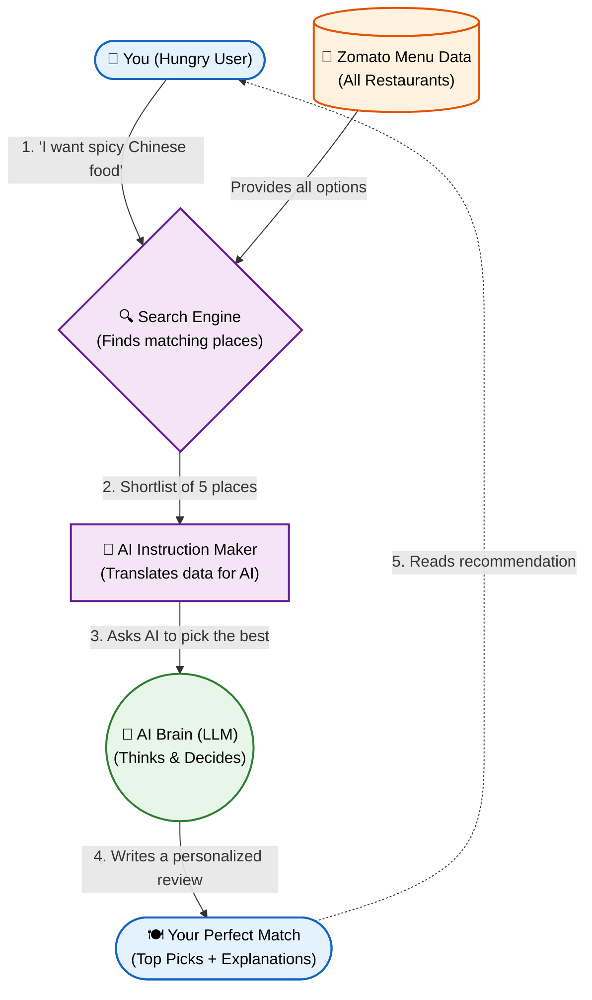

# Problem Statement: AI-Powered Restaurant Recommendation System (Zomato Use Case)

You are tasked with building an AI-powered restaurant recommendation service inspired by Zomato. The system should intelligently suggest restaurants based on user preferences by combining structured data with a Large Language Model (LLM).

## Objective

Design and implement an application that:
- Takes user preferences (such as location, budget, cuisine, and ratings)
- Uses a real-world dataset of restaurants
- Leverages an LLM to generate personalized, human-like recommendations
- Displays clear and useful results to the user

## System Workflow

### 1. Data Ingestion
- Load and preprocess the Zomato dataset from Hugging Face: [zomato-restaurant-recommendation](https://huggingface.co/datasets/ManikaSaini/zomato-restaurant-recommendation)
- Extract relevant fields such as restaurant name, location, cuisine, cost, rating, etc.

### 2. User Input
Collect user preferences:
- Location (e.g., Delhi, Bangalore)
- Budget (low, medium, high)
- Cuisine (e.g., Italian, Chinese)
- Minimum rating
- Any additional preferences (e.g., family-friendly, quick service)

### 3. Integration Layer
- Filter and prepare relevant restaurant data based on user input
- Pass structured results into an LLM prompt
- Design a prompt that helps the LLM reason and rank options

### 4. Recommendation Engine
Use the LLM to:
- Rank restaurants
- Provide explanations (why each recommendation fits)
- Optionally summarize choices

### 5. Output Display
Present top recommendations in a user-friendly format:
- Restaurant Name
- Cuisine
- Rating
- Estimated Cost
- AI-generated explanation

## System Architecture

## Success Criteria

- **Relevance:** The recommendations accurately reflect the user's specific preferences (location, budget, cuisine, etc.).
- **Explanation Quality:** The LLM provides coherent, human-readable explanations that justify why a restaurant was recommended.
- **Latency:** The system responds in a reasonable time frame suitable for user interaction.
- **Accuracy:** The structured data shown (e.g., cost, rating) correctly matches the original dataset.
- **Robustness:** The application handles edge cases gracefully, such as overly restrictive user preferences where no exact match exists, by providing reasonable fallbacks or clear messaging.
